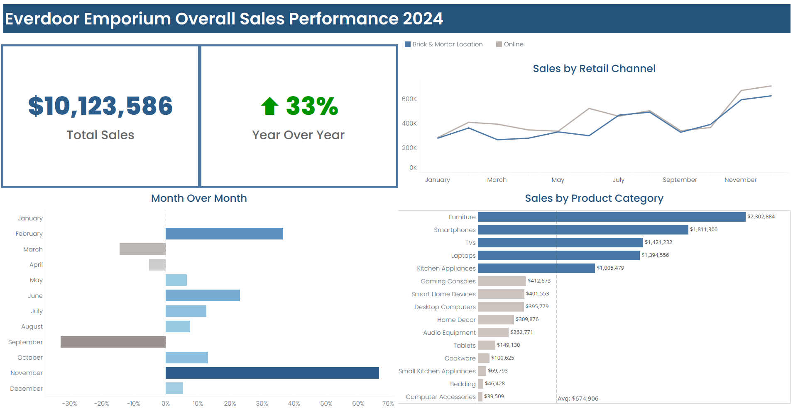
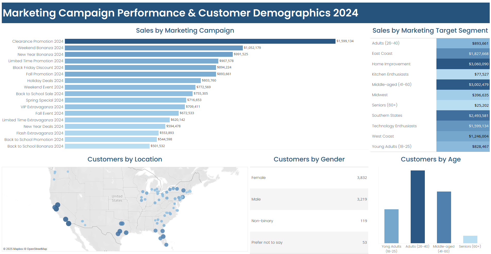

# Everdoor Emporium
## Project Background
Everdoor Emporium is an omnichannel retail store selling a variety of home goods, kitchenware, and electronics products. This project was designed to explore and analyze customer engagement and marketing performance for 2024 across both digital and physical channels. 

Technical Details about the project can be found here: <a href="#project-technical-details">Project Technical Details</a>

## Everdoor Emporium Sales Performance 2024

\
\
Thw live Tableau Daashboards can be viewed here:  [Tableau Public Dashboards](https://public.tableau.com/app/profile/scott.solik/vizzes)

## Key Takeaways

-	Everdoor Emporium had an excellent year in 2024 with strong double-digit YoY growth.
-	Online and in-store channels are well-balanced, with online slightly outperforming.
-	Strategic focus on high-revenue categories like Furniture and Smartphones is paying off.
-	Investigate the dip in **September** and consider growth strategies for underperforming categories.
-	**February and November** should be modeled for future campaigns given their standout results.

## Sales Performance Insights
### Overall Sales Performance
-	**Total Revenue:**
The business generated **$10,123,586** in total sales for the year.
-	**Year-Over-Year Growth:**
Sales grew by an impressive **33%** compared to the previous year, indicating the effectiveness of marketing efforts, customer engagement, and channel strategy.

### Sales by Retail Channel
-	**Channel Performance:**
Sales were well distributed across **Online** and **Brick & Mortar** channels. While both channels trended upward, **online sales consistently outperformed**, particularly during peak months such as **May** and **November**. This suggests that digital marketing and e-commerce capabilities are yielding strong returns.
-	**Key trends:**
    - **May and November** showed strong online growth, especially in **November**, likely due to holiday promotions.
    - **Brick & Mortar** followed a similar upward trend, indicating consistency across channels.

### Month-Over-Month Growth
-	**Biggest growth spikes:**
    -	**February and November** experienced the highest month-over-month sales increases, likely driven by seasonal promotions or targeted campaigns.
-	**Notable decline:**
    -	**September** saw a marked decline, primarily in online sales, warranting further analysis to determine potential causes such as campaign gaps or inventory issues.
### Sales by Product Category
-	The top-performing category was **Furnitur**e ($2.3M), followed by **Smartphones**, **TVs**, and **Laptops**, each generating over **$1M** in sales.
-	Lower-performing categories included **Computer Accessories**, **Bedding**, and **Small Kitchen Appliances**, all under **$70K**, well below the **average category revenue of $674,906**.
-	The sales distribution suggests a strong consumer preference for high-ticket items and electronics, providing guidance for future inventory and marketing focus.
-	**Category Average Sales:** ~$674,906 — only the top five categories exceeded this threshold.

## Marketing Campaign Performance & Customer Demographics 2024

## Marketing Performance Insights
### Top Marketing Campaigns
-	The **Clearance Promotion 2024** was the most successful campaign, generating **$1.6M** in revenue.
-	Other top performers included:
    -	**Weekend Bonanza 2024** – $1.05M
    -	**New Year Bonanza 2024** – $991K
    -	**Limited Time Promotion 2024** – $908K
-	Campaigns tied to major holidays (e.g., **Black Friday**, **Holiday Deals**, **Fall Promotion**) also performed well, suggesting strong seasonal responsiveness.
### Target Segment Performance
-	The **Home Improvement** segment led all target groups, generating **$3.06M** in sales.
-	**Middle-aged (41 – 60)** customers contributed **$3.00M**, making them the most valuable age-based demographic.
-	Regional success was notable in:
    -	**Southern States** – $2.49M
    -	**East Coast** – $1.83M
    -	**West Coast** – $1.25M
-	Segments like **Seniors (60+)** and **Kitchen Enthusiasts** generated significantly lower revenue, suggesting either weak engagement or untapped potential.
### Customer Demographics
-	**Age Distribution:**
    -	The largest group of customers were aged **26 – 40**, followed by **41 – 60**, making those demographics critical to marketing strategy.
    -	Customers aged **60+** represented the smallest group.
-	**Gender Breakdown:**
    -	Slight female majority: **3,832 females** vs. **3,219 males**
    -	Small but meaningful representation from **non-binary** (119) and **prefer not to say** (53) groups.
-	**Customer Locations:**
    -	The customer base is broadly distributed across the U.S., with notable clusters in:
        -	**California, Texas, Florida, and the Northeast**
        -	Indications of strong urban and coastal market presence

## Recommendations
-	**Replicate Successful Campaigns:** Leverage insights from **February** and **November** to replicate successful promotional strategies during off-peak months.
-	**Address Seasonal Dips:** Investigate the **September decline** to identify correctable issues and mitigate future underperformance.
-	**Focus on High-Performing Categories:** Continue prioritizing **Furniture and Electronics**, while assessing the potential to bundle or promote lower-performing products.
-	**Channel Optimization:** Strengthen digital channel strategies, especially around seasonal periods, to further capitalize on online growth momentum.
-	**Invest in Proven Campaign Themes:** Replicate and expand on successful campaigns like **Clearance Promotions**, **Weekend Bonanzas**, and **Holiday Events**.
-	**Prioritize High-Value Segments:**
    -	Maintain strong focus on **Middle-aged** and **Home Improvement** shoppers.
    -	Expand outreach in **Southern** and **East Coast regions**.
-	**Explore Underperforming Segments:**
    -	Reevaluate strategies for **Seniors** and **Kitchen Enthusiasts** to identify if product offerings or messaging need adjustment.
-	**Age-Driven Targeting:**
    -	Tailor promotions to appeal to customers **26 – 60**, who make up the bulk of the customer base.
-	**Promote Inclusivity:**
    -	Continue inclusive marketing practices to welcome non-binary and diverse gender identities.

## Project Technical Details
### Tech Stack & Methodology
-	End-to-End Analysis
-	Excel:
    -	Data Cleaning & Standardization
    -	Data Formatting
    -	Segmentation Analysis
    -	Data Preparation
-	SQL (MySQL):
    -	Advanced Querying
    -	Database Creation
    -	Exploratory Data Analysis (EDA)
    -	Data Transformation
    -	Data Manipulation
-	Tableau:
    -	Data Aggregation
    -	Surface Trends and Insights
    -	Data Visualization
    -	Dashboard Creation

## Dataset Structure
The project utilizes a comprehensive dataset comprising six interconnected CSV files:
-	campaigns.csv (200 rows)
-	customer_reviews_complete.csv (1000 rows)
-	customers.csv (5000 rows)
-	interactions.csv (100,000 rows)
-	support_tickets.csv (3000 rows)
-	transactions.csv (32,296 rows)

  
Everdoor Emporium Entity Relationship Diagram (ERD)\
\
The live ERD can be viewed here: [ERD](https://dbdocs.io/ssolik/Everdoor_Emporium_ERD?view=relationships)

## Technical Process
Initially, the data was inspected and cleaned in Excel to ensure consistency and accuracy. An Entity Relationship Diagram (ERD) was developed to map out the relationships between the data tables and guide the analytical process. The cleaned data was loaded into MySQL for structured querying and in-depth analysis, with a primary focus on evaluating the effectiveness of marketing campaigns, understanding customer behavior, and identifying areas for operational improvement.  

Key insights derived from the analysis were visualized using Tableau dashboards to surface actionable narratives around campaign performance, customer satisfaction, and purchasing trends.

The original (raw) data files can be viewed here: [Raw CSV Files](https://github.com/ssolik/Everdoor_Emporium/tree/main/Data/RAW)\
The cleaned data files can be viewed here: [Cleaned CSV Files](https://github.com/ssolik/Everdoor_Emporium/tree/main/Data/Cleaned)\
The Issue Log from the data cleaning process can be viewed here: [Issue Log](https://github.com/ssolik/Everdoor_Emporium/blob/main/Everdoor-Emporium_Data-Cleaning_Issue-Log.xlsx)  
The SQL script is here: [SQL Script](https://github.com/ssolik/Everdoor_Emporium/blob/main/Everdoor%20Emporium.sql)

## Marketing Campaign Performance Definitions
Purchases were credited to a specific marketing campaign if they met the criteria for that campaign’s **target segment** (defined below) and occurred between the start date of the campaign and the end date of the **attrition window** – using the industry standard of 30 days following the end of the campaign.

For the purposes of this analysis, the following definitions were used:
### *Customer Demographics-Based Marketing Campaign*s
| Target Segment | Definition |
| --------------- | ------------- |
| East Coast | Customers who reside in: Connecticut, Maine, Massachusetts, New Hampshire, New Jersey, New York, Rhode Island, Pennsylvania, Vermont, or Washington, D.C. |
| Midwest | Customers who reside in: Illinois, Indiana, Iowa, Kansas, Michigan, Minnesota, Missouri, Nebraska, North Dakota, Ohio, South Dakota, or Wisconsin |
| Southern States |	Customers who reside in: Alabama, Arkansas, Delaware, Florida, Georgia, Kentucky, Louisiana, Maryland, Mississippi, North Carolina, Oklahoma, South Carolina, Tennessee, Texas, Virginia, or West Virginia |
| West Coast	| Customers who reside in: Alaska, Arizona, California, Colorado, Hawaii, Idaho, Montana, Nevada, New Mexico, Oregon, Utah, Washington, or Wyoming |
| Young Adults (18-25) |	Customers who are 18 – 25 years old |
| Adults (26-40)	| Customers who are 26 – 40 years old |
| Middle-aged (41-60) |	Customers who are 41 – 60 years old |
| Seniors (60+) |	Customers who are over 60 years old |

### *Products-Based Marketing Campaigns*
| Target Segment | Definition |
| --------------- | ------------- |
| Kitchen Enthusiasts	| Purchases from the following product categories: Cookware, Kitchen Appliances, Small Kitchen Appliances |
| Home Improvement	| Purchases from the following product categories: Bedding, Furniture, Home Decor, Smart Home Devices |
| Technology Enthusiasts	| Purchases from the following product categories: Audio Equipment, Computer Accessories, Desktop Computers, Gaming Consoles, Laptops, Smartphones, Tablets, TVs |
 
